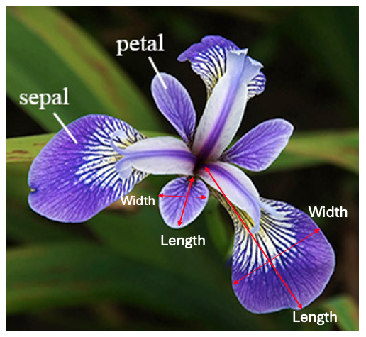

# Repository: pands-project

This repository contains my project completed for the module of Programming and Scripting in ATU with the lecturer Andrew Beatty.    
This project was prepared using several scripts in Python to analyse the so famous Iris dataset, aiming to demonstrate the steps taken to complete a data analysis and the use of Python programming to unfold a coherent and concise investigation of the dataset.

[Github's documentation on README](https://docs.github.com/en/repositories/managing-your-repositorys-settings-and-features/customizing-your-repository/about-readmes) was consulted to prepare this README file [[1]](#1).     
In addition, MarkDown was utilized throughout this README file taking into consideration [GitHub's Documentation](https://docs.github.com/en/get-started/writing-on-github/getting-started-with-writing-and-formatting-on-github/basic-writing-and-formatting-syntax) [[2]](#2).  

## About This Project

This project uses the Iris daset, also identified in the many sources as Fisher's or Anderson's Iris dataset [3]. This dataset holds historical significance as a cornerstone in statistical analysis and machine learning [4]. It was first introduced by statistician and biologist Ronald Fisher in 1936 and serves as a prime example of linear discriminant analysis [5]. Edgar Anderson collected the data to quantify morphological variations among three Iris species: setosa, versicolor, and virginica, each comprising 50 samples [6]. The samples are accompanied by measurements of sepal and petal length and width, which turned out to be crucial to classify the species [6]. 

Despite its age, the dataset remains a fundamental resource, which is still relevant today to teach and test subject for machine learning models [4]. Fisher's analysis has demonstrated distinct groupings among the species, supporting the development of models for accurate classification [7]. 

This dataset has since become a standard test case for various statistical classification techniques like support vector machines [4]. In addtion, the dataset's utility extends to unsupervised techniques, demonstrating separability among species through nonlinear principal component analysis [3]. Through its enduring relevance and usability, the Iris dataset continues to enrich both statistical education and advanced machine learning applications, and is being used in this project to explore the various techniques that can be used with Python to complete a proper data analysis [4].

Data was collected from three difference Iris flowers species: setosa, versicolor and virginica.    

    
*Iris species: setosa, versicolor, virginica*  [[8]](#8) [[9]](#9) [[10]](#10)       

- 4 measurements were taken from each Iris flower: sepal length (cm), sepal width (cm), petal length (cm), and petal width (cm).          

     
*Iris measurements: sepal length, sepal width, petal length, petal width* [[11]](#11)    

The Jupyter notebook [iris_project.ipynb](iris_project.ipynb) presents a detailed explanation of the Python programs, modules and functions used to analyse the Iris dataset as well the investigation outcomes achieved from each Python program.         
The [iris.data](iris.data) used for this analysis was from the [UCI Machine Learning Repository](https://archive.ics.uci.edu/dataset/53/iris) as recommended on the Programming and Scripting Project for the module of Programming and Scripting [[12]](#12) [[13]](#13). 

## Use of this project

Why this project is useful...

## Get Started 

How users can get started with the project...

## Get Help

Where users can get help with your project...

## Contribute

Who maintains and contributes to the project...

I used [openincolab.com](https://openincolab.com) to generate the following clickable link.
It opens the 'fib.ipynb' notebook in [Google Colab](https://colab.research.google.com)

## Author

About me...

## References

1
2
3 Iris Flower Data Set (2024) Wikipedia. Available at: https://en.wikipedia.org/wiki/Iris_flower_data_set (Accessed: 16 May 2024). 
4 Bozkus, E. (2022) Exploring the Iris Flower Dataset, Medium. Available at: https://eminebozkus.medium.com/exploring-the-iris-flower-dataset-4e000bcc266c#:~:text=There%20is%20a%20high%20correlation,high%20petal%20length%20and%20width. (Accessed: 16 May 2024). 
5 FISHER, R.A. (1936) ‘The use of multiple measurements in taxonomic problems’, Annals of Eugenics, 7(2), pp. 179–188. doi:10.1111/j.1469-1809.1936.tb02137.x. 
6 Anderson, E. (1936) ‘The species problem in Iris’, Annals of the Missouri Botanical Garden, 23(3), p. 457. doi:10.2307/2394164. 
7 Akman, O. et al. (2019) ‘Data clustering and self-organizing maps in biology’, Algebraic and Combinatorial Computational Biology, pp. 351–374. doi:10.1016/b978-0-12-814066-6.00011-8. 
8 Iris setosa (2024) Wikipedia. Available at: https://en.wikipedia.org/wiki/Iris_setosa#/media/File:Irissetosa1.jpg (Accessed: 16 May 2024). 
9 Iris versicolor (2024) Wikipedia. Available at: https://en.wikipedia.org/wiki/Iris_versicolor#/media/File:Blue_Flag,_Ottawa.jpg (Accessed: 16 May 2024).
10 Iris virginica (2024) Wikipedia. Available at: https://en.wikipedia.org/wiki/Iris_virginica#/media/File:Iris_virginica_2.jpg (Accessed: 16 May 2024). 
11  Example for principal component analysis (PCA): Iris Data (2019). Available at: https://www.math.umd.edu/~petersd/666/html/iris_pca.html (Accessed: 16 May 2024).
12 Fisher, R. (1988) Iris, UCI Machine Learning Repository. Available at: https://archive.ics.uci.edu/dataset/53/iris (Accessed: 16 May 2024). 
13 Beatty, A. (2024) Andrewbeattycourseware - pands-course-material/labs/Project 2024, GitHub. Available at: https://github.com/andrewbeattycourseware/pands-course-material/blob/main/labs/Project%202024.pdf (Accessed: 16 May 2024). 