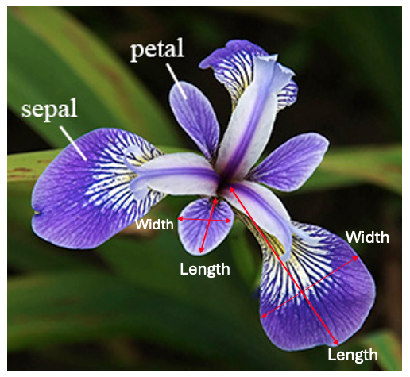

# Repository: pands-project

This repository contains my project completed for the module of Programming and Scripting in ATU with the lecturer Andrew Beatty.    
This project was prepared using several scripts in Python to analyse the so famous Iris dataset, aiming to demonstrate the steps taken to complete a data analysis and the use of Python programming to unfold a coherent and concise investigation of the dataset.

[Github's documentation on README](https://docs.github.com/en/repositories/managing-your-repositorys-settings-and-features/customizing-your-repository/about-readmes) was consulted to prepare this README file [[1]](#1).     
In addition, MarkDown was utilized throughout this README file taking into consideration [GitHub's Documentation](https://docs.github.com/en/get-started/writing-on-github/getting-started-with-writing-and-formatting-on-github/basic-writing-and-formatting-syntax) [[2]](#2).  

## About This Project

This project uses the Iris daset, also identified in the many sources as Fisher's or Anderson's Iris dataset [[3]](#3). This dataset holds historical significance as a cornerstone in statistical analysis and machine learning [[4]](#4). It was first introduced by statistician and biologist Ronald Fisher in 1936 and serves as a prime example of linear discriminant analysis [[5]](#5). Edgar Anderson collected the data to quantify morphological variations among three Iris species: setosa, versicolor, and virginica, each comprising 50 samples [[6]](#6). The samples are accompanied by measurements of sepal and petal length and width, which turned out to be crucial to classify the species [[6]](#6). 

Despite its age, the dataset remains a fundamental resource, which is still relevant today to teach and test subject for machine learning models [[4]](#4). Fisher's analysis has demonstrated distinct groupings among the species, supporting the development of models for accurate classification [[7]](#7). 

This dataset has since become a standard test case for various statistical classification techniques like support vector machines [[4]](#4). In addtion, the dataset's utility extends to unsupervised techniques, demonstrating separability among species through nonlinear principal component analysis [[3]](#3). Through its enduring relevance and usability, the Iris dataset continues to enrich both statistical education and advanced machine learning applications, and is being used in this project to explore the various techniques that can be used with Python to complete a proper data analysis [[4]](#4).

- Data was collected from three difference Iris flowers species: setosa, versicolor and virginica.    

 
*Iris species: setosa, versicolor, virginica*  [[8]](#8) [[9]](#9) [[10]](#10)       

- 4 measurements were taken from each Iris flower: sepal length (cm), sepal width (cm), petal length (cm), and petal width (cm).          

     
*Iris measurements: sepal length, sepal width, petal length, petal width* [[11]](#11)    
        
The [iris.data](iris.data) used for this analysis was from the [UCI Machine Learning Repository](https://archive.ics.uci.edu/dataset/53/iris) as recommended on the Programming and Scripting Project for the module of Programming and Scripting [[12]](#12) [[13]](#13). 

## Use of this project

This project is a valuable learning tool for anyone interested in honing their skills in Python programming and data analysis. By exploring the Iris dataset, users gain practical experience in various aspects of data analysis by providing the steps for data visualization, statistical analysis, and drawing conclusions from the provided data. This hands-on approach fosters a solid understanding of essential concepts and techniques applicable across diverse fields within the realm of data science, making it an invaluable resource for aspiring data enthusiasts and professionals alike.

## Get Started 

Here you can find a guide on how to navigate through this project. For each item below that is part of this project a clickable link is provided so you can also access it directly from here.
- Start by looking into the [iris_project.ipynb](iris_project.ipynb) as it presents a detailed explanation of the Python programs, modules and functions used to analyse the Iris dataset as well the investigation outcomes achieved from each Python program. 
- Then, try out by looking and running the different programs developed for this project and how they are related to each other. See an overview of each program in case you want to see any in particular:
    - [analysis.py](analysis.py): if you want to run all the programs at once, so this is the right program as all the other programs are loaded in and executed through this script.
    - [load_iris.py](load_iris.py): the program loads the Iris dataset to be used in the other programs.
    - [summary.py](summary.py): this program outputs a summary of each variable in the Iris dataset to a single text file.
    - [histogram.py](histogram.py): it saves a histogram of each continuous variable of the Iris dataset to png files that are saved in the repository histogram.
    - [scatterplot.py](scatterplot.py): this script displays a figure with several scatter plots of each pair of continuous variables grouped by the categorical variable.
    - [heatmap.py](heatmap.py): this program displays a heat map of the correlation of each pair of continuous variable.
    - [correlation.py](correlation.py): it prints out a correlation analysis based on the oucomes of the correlation coeficient of the pairs of continuous variables. This program is loaded in summary.py.
- Finally, you can review some of the files generated from these programs:
    - [summary.txt](summary.txt): this text file provides details of the Iris dataset such as the first and last 5 rows of the dataset; a summary of the data types, categorical and continuos variables, and the correlation analysis.
    - [iris.data](iris.data): this file contains the Iris dataset imported from the [UCI Machine Learning Repository](https://archive.ics.uci.edu/dataset/53/iris) [[12]](#12).
    - [histogram](histogram): this folder contains all the histograms in png files generated when running histogram.py.
    - [imported_images](imported_images): this folder contains all the imported images that were edit and used in this project.

## Get Help

If you have any questions or need assistance while reviewing this project on Iris dataset, feel free to reach out to me via GitHub. I'll be glad to offer more information and support.   
A comprehensive list of references is available at the end of this README file. The numbers provided throughout this README.md and the notebook files (e.g., iris_project.ipynb) are direct links to their respective references in the reference section. These references can provide additional insights into the methodologies and fundamentals employed in constructing this project. 

## Contribute

I used [openincolab.com](https://openincolab.com) to generate the following clickable link [[14]](#14).   
It opens the [iris_project.ipynb](iris_project.ipynb) notebook in [Google Colab](https://colab.research.google.com) [[15]](#15).

## Author

Presently, I work as a Quality Engineer, having a foundation in Production Engineering & Management. With approximately 12 years of expertise spanning the medical device and automotive assembly sectors, I am now pursuing a career shift by undertaking a Data Analytics course at ATU. My ultimate objective is to transition into Artificial Intelligence.   

For further insights into my background, feel free to connect with me on LinkedIn: [Filipe Carvalho](https://www.linkedin.com/in/filipe-carvalho-8146232a/)

## Reference

<a id="1">[1]</a> About readmes (no date) GitHub Docs. Available at: https://docs.github.com/en/repositories/managing-your-repositorys-settings-and-features/customizing-your-repository/about-readmes (Accessed: 16 May 2024).   

<a id="2">[2]</a> Basic writing and formatting syntax (no date) GitHub Docs. Available at: https://docs.github.com/en/get-started/writing-on-github/getting-started-with-writing-and-formatting-on-github/basic-writing-and-formatting-syntax (Accessed: 16 May 2024).    

<a id="3">[3]</a> Iris Flower Data Set (2024) Wikipedia. Available at: https://en.wikipedia.org/wiki/Iris_flower_data_set (Accessed: 16 May 2024).    

<a id="4">[4]</a> Bozkus, E. (2022) Exploring the Iris Flower Dataset, Medium. Available at: https://eminebozkus.medium.com/exploring-the-iris-flower-dataset-4e000bcc266c#:~:text=There%20is%20a%20high%20correlation,high%20petal%20length%20and%20width. (Accessed: 16 May 2024).    

<a id="5">[5]</a> FISHER, R.A. (1936) ‘The use of multiple measurements in taxonomic problems’, Annals of Eugenics, 7(2), pp. 179–188. doi:10.1111/j.1469-1809.1936.tb02137.x.    

<a id="6">[6]</a> Anderson, E. (1936) ‘The species problem in Iris’, Annals of the Missouri Botanical Garden, 23(3), p. 457. doi:10.2307/2394164.     

<a id="7">[7]</a> Akman, O. et al. (2019) ‘Data clustering and self-organizing maps in biology’, Algebraic and Combinatorial Computational Biology, pp. 351–374. doi:10.1016/b978-0-12-814066-6.00011-8.    

<a id="8">[8]</a> Iris setosa (2024) Wikipedia. Available at: https://en.wikipedia.org/wiki/Iris_setosa#/media/File:Irissetosa1.jpg (Accessed: 16 May 2024).    

<a id="9">[9]</a> Iris versicolor (2024) Wikipedia. Available at: https://en.wikipedia.org/wiki/Iris_versicolor#/media/File:Blue_Flag,_Ottawa.jpg (Accessed: 16 May 2024).    

<a id="10">[10]</a> Iris virginica (2024) Wikipedia. Available at: https://en.wikipedia.org/wiki/Iris_virginica#/media/File:Iris_virginica_2.jpg (Accessed: 16 May 2024).     

<a id="11">[11]</a>  Example for principal component analysis (PCA): Iris Data (2019). Available at: https://www.math.umd.edu/~petersd/666/html/iris_pca.html (Accessed: 16 May 2024).    

<a id="12">[12]</a> Fisher, R. (1988) Iris, UCI Machine Learning Repository. Available at: https://archive.ics.uci.edu/dataset/53/iris (Accessed: 16 May 2024).     

<a id="13">[13]</a> Beatty, A. (2024) Andrewbeattycourseware - pands-course-material/labs/Project 2024, GitHub. Available at: https://github.com/andrewbeattycourseware/pands-course-material/blob/main/labs/Project%202024.pdf (Accessed: 16 May 2024).    

<a id="14">[14]</a> (No date) Open in Colab. Available at: https://openincolab.com/ (Accessed: 16 May 2024).    

<a id="15">[15]</a> (No date a) Google colab. Available at: https://colab.research.google.com/ (Accessed: 16 May 2024).  

<a id="16">[16]</a> Kabaki, A. (2023) Understanding modules and packages in Python, SitePoint. Available at: https://www.sitepoint.com/python-modules-packages/ (Accessed: 20 May 2024). 

<a id="17">[17]</a> Ibrahim, M. (2023) Module, package, Library & Framework - a real-life example, LinkedIn. Available at: https://www.linkedin.com/pulse/module-package-library-framework-real-life-example-mohammad-ibrahim#:~:text=In%20summary%2C%20a%20module%20is,of%20principles%20for%20developing%20applications. (Accessed: 20 May 2024). 

<a id="18">[18]</a> OS - miscellaneous operating system interfaces (no date) Python documentation. Available at: https://docs.python.org/3/library/os.html (Accessed: 20 May 2024). 

<a id="19">[19]</a> Pandas (no date) PyPI. Available at: https://pypi.org/project/pandas/ (Accessed: 20 May 2024). 

<a id="20">[20]</a> Ram, V. (2023) Python IO module: The complete practical reference, AskPython. Available at: https://www.askpython.com/python-modules/python-io-module (Accessed: 20 May 2024). 

<a id="21">[21]</a> GeeksforGeeks (2024) Pyplot in Matplotlib, GeeksforGeeks. Available at: https://www.geeksforgeeks.org/pyplot-in-matplotlib/ (Accessed: 20 May 2024). 

<a id="22">[22]</a> NumPy (2024) Wikipedia. Available at: https://en.wikipedia.org/wiki/NumPy (Accessed: 20 May 2024). 

<a id="23">[23]</a> Statistical Functions (scipy.stats)# (no date) Statistical functions (scipy.stats) - SciPy v1.13.0 Manual. Available at: https://docs.scipy.org/doc/scipy/reference/stats.html (Accessed: 20 May 2024). 

<a id="24">[24]</a> Scipy.stats.norm# (no date) scipy.stats.norm - SciPy v1.13.0 Manual. Available at: https://docs.scipy.org/doc/scipy/reference/generated/scipy.stats.norm.html#scipy.stats.norm (Accessed: 20 May 2024). 

<a id="25">[25]</a> Scipy.stats.skew# (no date) scipy.stats.skew - SciPy v1.13.0 Manual. Available at: https://docs.scipy.org/doc/scipy/reference/generated/scipy.stats.skew.html (Accessed: 20 May 2024). 

<a id="26">[26]</a> Statistical Data Visualization# (no date) seaborn. Available at: https://seaborn.pydata.org/ (Accessed: 20 May 2024). 

<a id="27">[27]</a> Tyagi, A. (2023) Comprehensive guide to python’s tabulate library, Analytics Vidhya. Available at: https://www.analyticsvidhya.com/blog/2023/12/mastering-tabulate/ (Accessed: 20 May 2024). 
